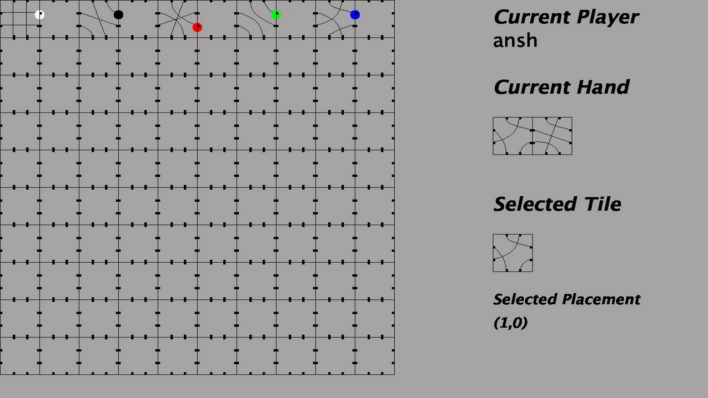
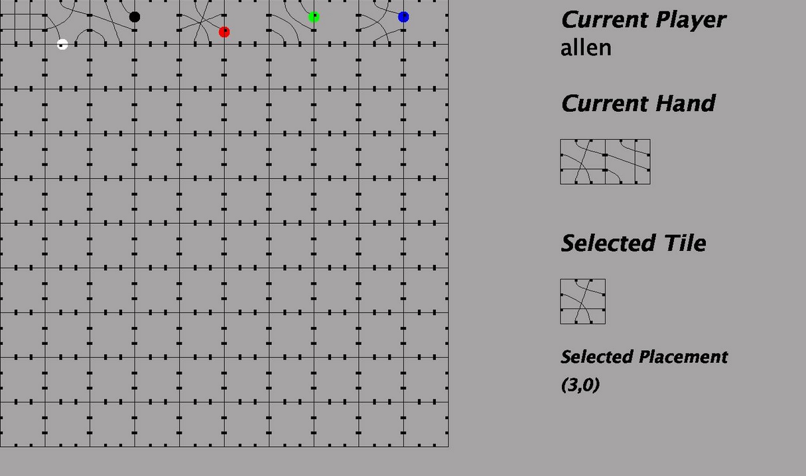

# Tsuro
Multiplayer implementation of Tsuro using remote clients and a server.

### Example turn
Ansh can view the tiles in his hand to choose from, as well as the one he has currently selected. He can also see the board and the coordinates at which his selected tile will be placed once he confirms his move. The automated referee ensures that only legal placements are allowed.

### Subsequent turn

